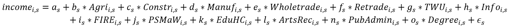
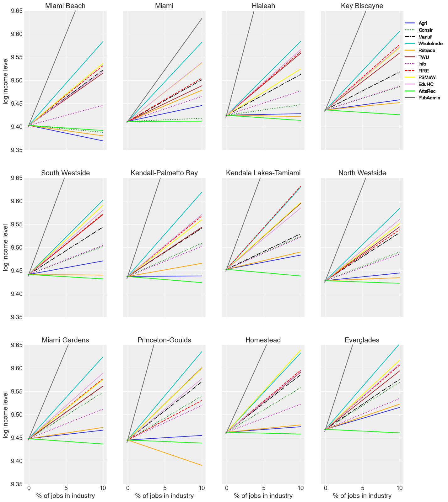
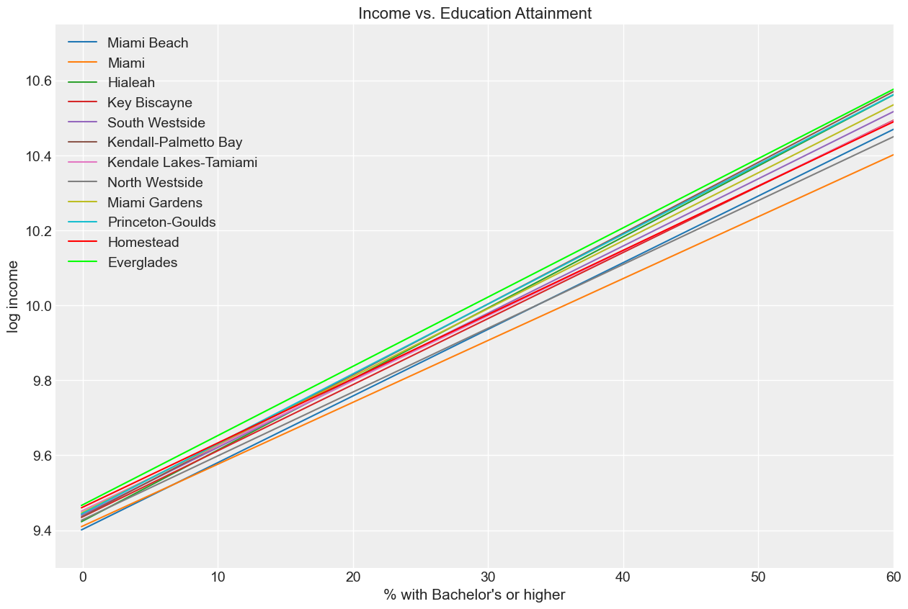
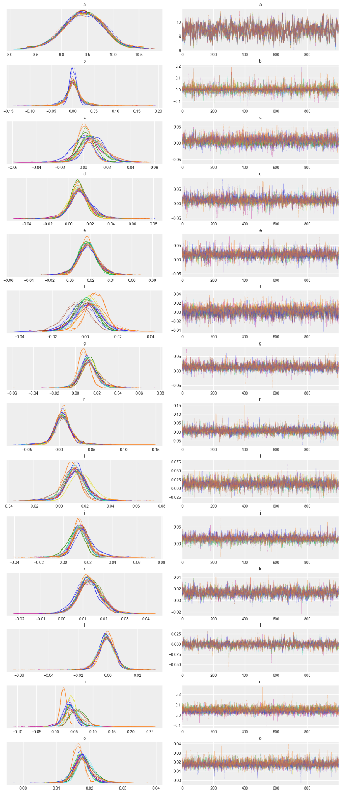

# 
Industry Employment and Educational Attainment in Response to Median Income: A Bayesian Approach

## Problem:

The COVID-19 pandemic sent shockwaves across the world causing economic
shutdowns and country lockdowns. The infectious disease caused by the
newly discovered coronavirus has led to hundreds of thousands of deaths,
and still counting. As the health and human toll grows, the economic
damage encountered thus far is evident with the world experiencing the
largest economic shock in decades. Economic prospect reports envision
contractions in the global GDP with a loss of human capital through lost
work, schooling, and fragmentation of supply linkages.

The United States has witnessed the highest number of cases and deaths
during this pandemic. Shifting our focus to Florida, the state has seen
almost 2.75million cases with approximately 40,000 deaths thus far.
Schools have been suspended, small businesses have suffered and have had
to shut down, the economy is at a standstill. "The best case scenario
doesn\'t look that good," several business owners state. A team of Data
Scientists from the University of Virginia were approached to tackle the
economic issue currently faced by the city of Miami due to the pandemic.
The goal is to model map data from Federal agencies, city departments,
smart city sensors, residents' reviews and other datasets to advance the
City's economic recovery efforts. These models will be aimed to offer a
real-time understanding of Miami's economy, responding to both the
current environment and providing a long-term solution as the city moves
into its post-pandemic recovery.

To start things off, the team from the University of Virginia looked at
data from OnTheMap, a tool of the US Census Bureau, which is a web-based
mapping and reporting application showing where workers are located and
employed. It reports data at individual tract levels on employees' age,
industry distribution (percent of tract employed in each industry),
race, ethnicity, educational attainment, and sex. The problems we would
like to tackle and explore are:

a)  How do the predictor variables listed above, specifically industry
    employment distribution and educational attainment, affect the
    median income of individual census tracts within different
    subdivisions of Miami-Dade County?

b)  Which industries perform particularly well and lead to a higher
    median income, as well as the importance of a bachelor's degree in
    determining income for each subdivision?

## Approach:

To tackle this, we attempted a hierarchical regression. This is a type
of linear regression where the observations in the dataset fall in a
nested level, commonly known as a hierarchy. They could be thought of as
a multilevel model, which allows for effects of predictors to vary
across various subdivisions. The model takes the following form (with
the usual beta coefficients having been replaced with letters here; i.e.
𝛽~0~ = 𝑎, 𝛽~1~ = 𝑏 and so forth):

Where the above is representative of:

-   *income* - the median log income level of an individual census
    tract. A log transformation was applied to ensure a normal
    distribution, as the raw median income distribution across tracts
    was extremely positively skewed

-   *a~s~* - the subdivision level intercept (i.e. the median income
    level of the tract all else null)

-   *b~s~* - the subdivision level effect of an increase of jobs in the
    Agriculture, forestry, fishing and hunting, and mining industry on
    median income

-   *c~s~* - the subdivision level effect of an increase of jobs in the
    Construction industry on median income

-   *d~s~* - the subdivision level effect of an increase of jobs in the
    Manufacturing industry on median income

-   *e~s~* - the subdivision level effect of an increase of jobs in the
    Wholesale trade industry on median income

-   *f~s~* - the subdivision level effect of an increase of jobs in the
    Retail trade industry on median income

-   *g~s~* - the subdivision level effect of an increase of jobs in the
    Transportation and warehousing, and utilities industry on median
    income

-   *h~s~* - the subdivision level effect of an increase of jobs in the
    Information industry on median income

-   *i~s~* - the subdivision level effect of an increase of jobs in the
    Finance and insurance, and real estate and rental and leasing
    industry on median income

-   *j~s~* - the subdivision level effect of an increase of jobs in the
    Professional, scientific, and management, and administrative and
    waste management services industry on median income

-   *k~s~* - the subdivision level effect of an increase of jobs in the
    Educational services, and health care and social assistance industry
    on median income

-   *l~s~* - the subdivision level effect of an increase of jobs in the
    Arts, entertainment, and recreation, and accommodation and food
    services industry on median income

-   *n~s~* - the subdivision level effect of an increase of jobs in the
    Public administration industry on median income

-   *o~s~* - the subdivision level effect of an increase in percentage
    of residents holding a Bachelor's degree or higher on median income

-   *ϵ~s~* - the subdivision level error term

This linear relationship allows us to see the different effects certain
industries have on median income across different subdivisions of
Miami-Dade county; that is to say, are certain industries more important
in terms of increasing median income level in certain subdivisions than
others? This model also allows us to see the importance of educational
attainment per subdivision by seeing the effect percentage of residents
holding at least a bachelor's degree has on median income.

## Findings:

Interestingly, after training our model and looking at the results by
subdivision, it appears that the industry that could have the biggest
effect on increasing median income, across all subdivisions, is public
administration, followed closely by the wholesale trade industry. In the
majority of subdivisions, the arts, entertainment, recreation, and
accommodation and food services industry seems to have the lowest effect
on increasing median income, and in fact, it actually appears that the
higher the percentage of people employed in that industry are, the lower
the median income level would be in each subdivision. This is not too
surprising, as a quick Google search of "lowest paying jobs" will be
topped by a host of occupations in the restaurant and food services
industry. In most subdivisions, the retail trade and agriculture,
forestry, fishing and hunting, and mining industries appear to have flat
to minorly positive effects on increasing median income, however, when
we look at the subdivisions of Miami Beach and Princeton-Goulds, a
different story emerges. An increase in retail trade jobs in
Princeton-Goulds has a negative effect on median income, while an
increase in both retail trade and agriculture, forestry, fishing and
hunting, and mining jobs in Miami Beach would have a negative effect on
median income. These results do not necessarily mean that public
administration and wholesale trade jobs pay the most, but could be
indicative that they are industries experiencing labor shortages that,
on average, pay more relative to some of the other industries, such as
the arts, entertainment, recreation, and accommodation and food services
industry, and perhaps incentivizing individuals to change industries
could lead to an increase in median income in the area. A quick search
of the datausa.io database does indicate that the average salary of
public administration employees is \$66,232, compared to only \$26,814
of those in arts, entertainment, recreation, and accommodation and food
services.

The above chart makes it apparent that increasing the education level of
residents in certain subdivisions means more, in terms of increasing
median income, than it does in other subdivisions. For instance, in the
subdivision for the city of Miami, increasing the percentage of
residents who have a bachelor's degree or higher would have far less of
an effect on increasing median income in the area than it would in more
rural areas, such as the subdivisions of the Everglades and
Princeton-Goulds. This is most likely due to the fact that these areas
already have a lower average percentage of bachelor's degree attainment
among their residents, than the more urban areas do, so increasing
educational attainment in already underserved areas would certainly mean
more than it would in areas where more residents already have a
bachelor's degree.

## Summary:

After training our model and examining our findings, a similar result
emerges across all subdivisions in Miami-Dade county when it comes to
increasing the median income of each area. Our model suggests a shift in
the distribution of resident employment from certain lower paying
industries, such as that of arts, entertainment, recreation, and
accommodation and food services, to those with a higher relative average
pay (that are perhaps underserved), such as public administration and
wholesale trade, would lead to an increase in the median income level
for each area, albeit the magnitude of these effects vary by
subdivision. For instance, a shift in employment distribution to more
public administration jobs would have a larger effect on increasing
median income in the Hialeah subdivision than it would in the city of
Miami (as evident by the slope of their respective lines). Similarly,
our model shows that increasing the educational attainment of residents,
represented as the percentage with a bachelor's degree or higher, would
also lead to an increase in median income across all subdivisions. Again
though, the magnitude of this effect would be much greater in certain
subdivisions than others, specifically more rural areas, such as the
Everglades and Princeton-Goulds, than it would be in more urban areas,
such as the city of Miami.

## Appendix/Diagnostics:

When we look at the above trace plots, it appears that all of our
parameters' estimates converged without issue. There were zero
divergences, and each chain for every subdivision appears to line up
fairly nicely. This conclusion is further supported by the Gelman-Rubin
statistic of each of the parameters, as none of them exceeded 1.01 (with
the majority having a r-hat of exactly 1.0).
